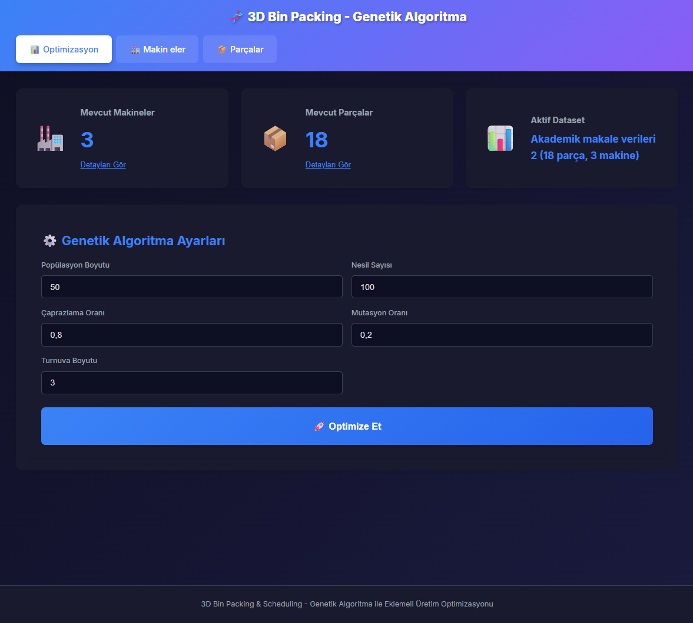
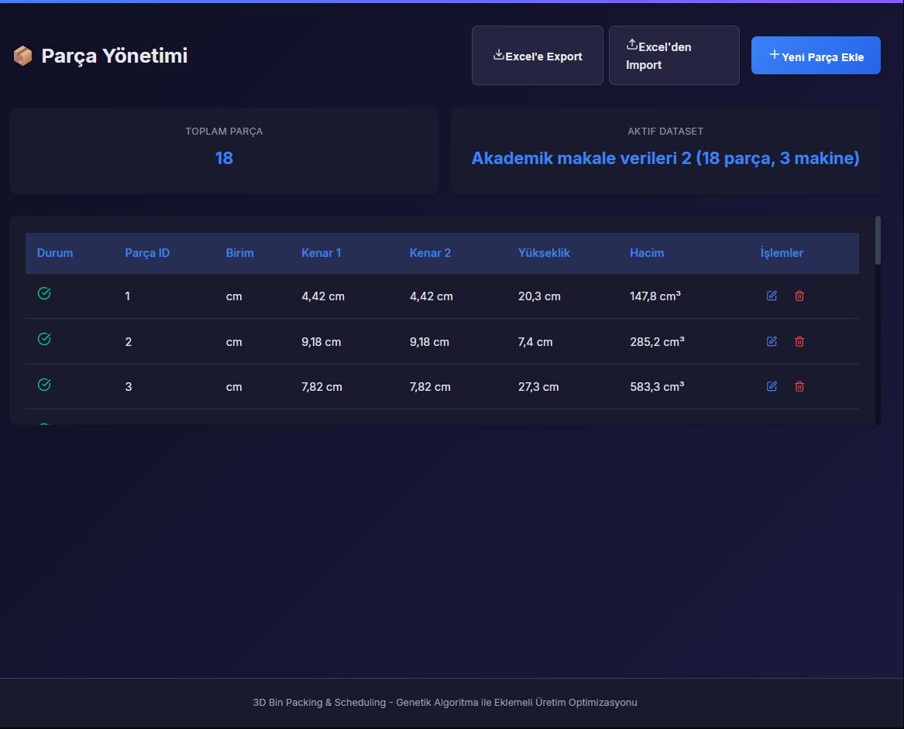
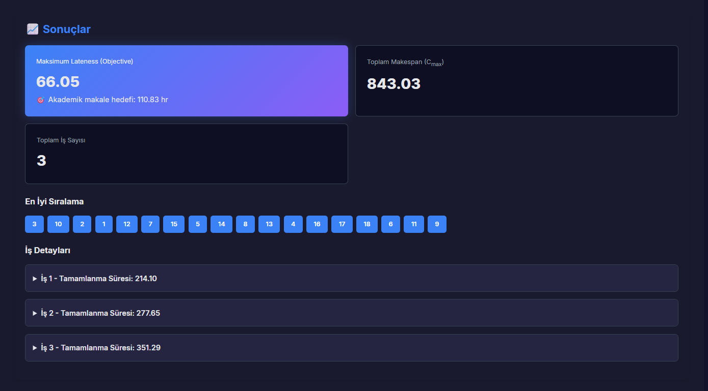
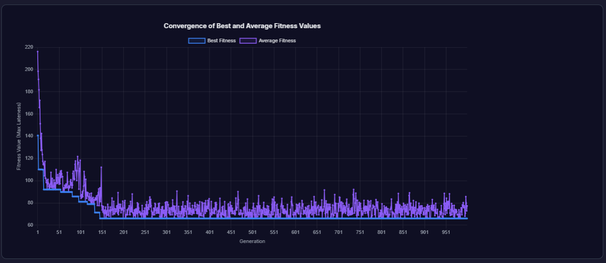
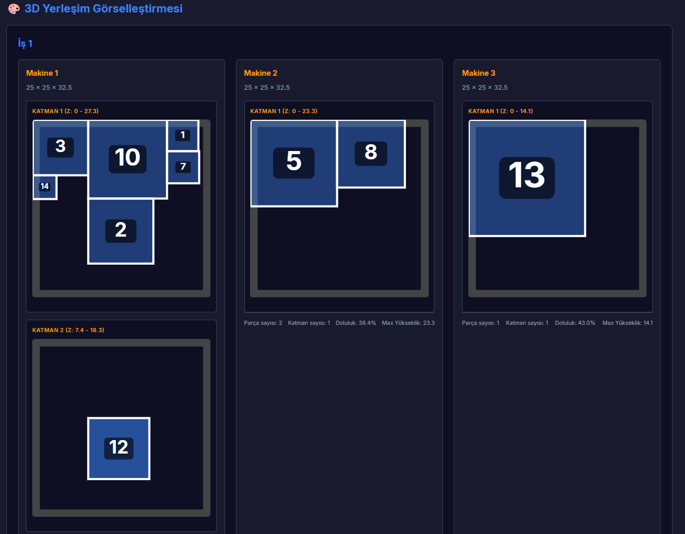

# 3D Bin Packing & Scheduling Optimization with Genetic Algorithm

[](https://www.typescriptlang.org/)
[](https://reactjs.org/)
[](https://vitejs.dev/)

**3D Bin Packing & Scheduling Optimization** projesi, eklemeli imalat (3D baskı) süreçlerinde parça yerleşimi ve makine çizelgeleme problemini çözmek için geliştirilmiş, **Genetik Algoritma (GA)** tabanlı bir optimizasyon aracıdır.

Bu proje, akademik araştırma ve endüstriyel uygulamalar için tasarlanmış, **Hybrid Bottom-Left-Fill with Layer-based Grid Search (BLFLG)** algoritması kullanarak 3D parçaları makinelere en verimli şekilde yerleştirir ve üretim çizelgesini optimize eder.

---

## 🎯 Proje Hedefi

Eklemeli imalat süreçlerinde:
- **3D parçaların** makine platformlarına en verimli şekilde yerleştirilmesi
- **Makine çizelgelemesi** ile üretim süresinin optimize edilmesi
- **Maximum Lateness (L_max)** metriği ile teslim tarihlerine uyumun maksimize edilmesi
- **Akademik benchmark test setleri** ile algoritma performansının doğrulanması

---

## ✨ Özellikler

### 🧬 Genetik Algoritma Optimizasyonu
- **Popülasyon tabanlı arama** ile global optimuma yakınsama
- **Elitizm stratejisi** ile en iyi çözümlerin korunması
- **Turnuva seçimi** ile çeşitliliğin sağlanması
- **Tek nokta çaprazlama** ve **swap mutasyonu** operatörleri
- **Gerçek zamanlı yakınsama grafiği** ile optimizasyon sürecinin görselleştirilmesi

### 📦 Hybrid BLFLG Yerleşim Algoritması
- **Bottom-Left-Fill** prensibi ile kompakt yerleşim
- **Layer-based Grid Search** ile boşlukların tespit edilmesi
- **Corner-based heuristic** ile hızlı köşe noktası bulma
- **Adaptive step size** ile parça boyutuna göre dinamik arama
- **3D overlap detection** ile çakışma kontrolü

### 📊 Kapsamlı Raporlama ve Görselleştirme
- **Iterasyon geçmişi** ile algoritma performansının izlenmesi
- **Yakınsama grafiği** (Chart.js) ile fitness değişiminin görselleştirilmesi
- **Parça yerleşim detayları** ile her parçanın konumunun raporlanması
- **Excel export** ile sonuçların dışa aktarılması
- **Çoklu birim desteği** (mm, cm, m) ile esnek ölçüm sistemi

### 🔬 Akademik Test Desteği
- **JSON tabanlı test seti yönetimi** ile benchmark testlerinin kolayca yüklenmesi
- **Kucukkoc PPC** ve diğer akademik veri setleri ile uyumluluk
- **Tip-safe veri yapıları** ile hata oranının minimize edilmesi

---

## 🧮 Algoritma Mantığı

### Genel Akış

Proje, iki aşamalı bir optimizasyon süreci kullanır:

1. **Genetik Algoritma (GA)**: Parçaların sırasını optimize eder
2. **Hybrid BLFLG Decoder**: Verilen sıralamaya göre parçaları makinelere yerleştirir

```
┌─────────────────────────────────────────────────────────────┐
│                    Genetik Algoritma                        │
│  ┌─────────────┐   ┌──────────┐   ┌──────────┐            │
│  │ Popülasyon  │──▶│ Seçim    │──▶│ Çaprazlama│            │
│  │ Oluşturma   │   │ (Turnuva)│   │ (1-point) │            │
│  └─────────────┘   └──────────┘   └──────────┘            │
│         │                                │                  │
│         │          ┌──────────┐          │                  │
│         └─────────▶│ Mutasyon │◀─────────┘                  │
│                    │ (Swap)   │                             │
│                    └──────────┘                             │
│                         │                                   │
│                         ▼                                   │
│                  ┌──────────────┐                           │
│                  │ BLFLG Decoder│                           │
│                  │ (Yerleşim)   │                           │
│                  └──────────────┘                           │
│                         │                                   │
│                         ▼                                   │
│                  ┌──────────────┐                           │
│                  │ Fitness      │                           │
│                  │ (L_max)      │                           │
│                  └──────────────┘                           │
└─────────────────────────────────────────────────────────────┘
```

### Hybrid BLFLG Algoritması

**BLFLG (Bottom-Left-Fill with Layer-based Grid Search)** algoritması, parçaları 3D platformlara yerleştirirken şu adımları izler:

#### 1️⃣ Z Seviyelerini Belirleme
```typescript
// Mevcut parçaların üst yüzeylerini Z seviyeleri olarak kullan
Z_levels = {0} ∪ {z + height | her yerleştirilmiş parça için}
```

#### 2️⃣ Her Z Seviyesinde Arama
Her Z seviyesi için iki farklı arama stratejisi kullanılır:

**a) Grid Search (Kapsamlı Arama)**
```typescript
step_x = max(1, floor(part.width / 4))
step_y = max(1, floor(part.depth / 4))

for (x = 0; x < machine.width; x += step_x) {
  for (y = 0; y < machine.depth; y += step_y) {
    if (canPlace(x, y, z)) {
      candidates.push({x, y, z, score: z*10^6 + y*10^3 + x})
    }
  }
}
```

**b) Corner Search (Hızlı Köşe Bulma)**
```typescript
// Mevcut parçaların köşe noktalarını test et
for (placed_part of placed_parts) {
  corners = [
    {x: placed_part.x + placed_part.width, y: placed_part.y, z},
    {x: placed_part.x, y: placed_part.y + placed_part.depth, z},
    // ... diğer köşeler
  ]
  for (corner of corners) {
    if (canPlace(corner.x, corner.y, corner.z)) {
      candidates.push({...corner, score: z*10^6 + y*10^3 + x})
    }
  }
}
```

#### 3️⃣ En İyi Pozisyonu Seçme
```typescript
// Bottom-Left prensibi: Önce Z, sonra Y, sonra X
best_position = candidates.sort((a, b) => a.score - b.score)[0]
```

#### 4️⃣ Çakışma Kontrolü
```typescript
function canPlace(x, y, z, part) {
  // Makine sınırları kontrolü
  if (x + part.width > machine.width) return false
  if (y + part.depth > machine.depth) return false
  if (z + part.height > machine.height) return false
  
  // Overlap kontrolü
  for (placed of placed_parts) {
    if (overlaps3D(placed, {x, y, z, ...part})) {
      return false
    }
  }
  
  return true
}
```

### Neden Hybrid?

**Grid Search** ve **Corner-based** yaklaşımların birleşimi:

- ✅ **Grid Search**: Boşlukları tespit eder, köşe olmayan pozisyonları bulur
- ✅ **Corner Search**: Hızlı köşe noktası bulma, hesaplama maliyetini düşürür
- ✅ **Adaptive Step**: Büyük parçalar için hızlı, küçük parçalar için hassas arama

> 📖 **Detaylı algoritma açıklaması ve adım adım örnek için:**  
> [algorithm_step_by_step_example.md](./algorithm_step_by_step_example.md) dosyasını inceleyebilirsiniz.

---

## 🚀 Kurulum ve Çalıştırma

### Gereksinimler
- **Node.js** (v18 veya üzeri)
- **npm** veya **yarn**

### Kurulum

```bash
# Repository'yi klonlayın
git clone https://github.com/alidmrky/3DPackagingAM.git
cd 3DPackagingAM

# Bağımlılıkları yükleyin
npm install
```

### Geliştirme Modu

```bash
npm run dev
```

Tarayıcınızda `http://localhost:5173` adresine gidin.

### Production Build

```bash
npm run build
npm run preview
```

---

## 📸 Ekran Görüntüleri

### Ana Dashboard


### Makine Yönetimi


### Parça Yönetimi


### Optimizasyon Sonuçları


### Yakınsama Grafiği


### Parça Yerleşim Detayları


---

## 📁 Proje Yapısı

```
3DBinPacking/
├── src/
│   ├── algorithms/          # Algoritma implementasyonları
│   │   ├── BinPackingLogic.ts    # BLFLG yerleşim algoritması
│   │   ├── GeneticAlgorithm.ts   # GA implementasyonu
│   │   ├── CostCalculator.ts     # Fitness hesaplama
│   │   └── LatenessCalculator.ts # L_max hesaplama
│   ├── components/          # React bileşenleri
│   │   ├── Controls.tsx          # GA parametreleri
│   │   ├── ConvergenceChart.tsx  # Yakınsama grafiği
│   │   ├── Results.tsx           # Sonuç görüntüleme
│   │   └── Visualization.tsx     # 3D görselleştirme
│   ├── pages/               # Sayfa bileşenleri
│   │   ├── PartsPage.tsx         # Parça yönetimi
│   │   ├── MachinesPage.tsx      # Makine yönetimi
│   │   └── OptimizationPage.tsx  # Optimizasyon sayfası
│   ├── data/                # Test veri setleri (JSON)
│   ├── types/               # TypeScript tip tanımları
│   ├── utils/               # Yardımcı fonksiyonlar
│   └── workers/             # Web Worker (GA paralel işleme)
├── algorithm_step_by_step_example.md  # Detaylı algoritma açıklaması
├── academic_paper.md        # Akademik dokümantasyon
└── README.md
```

---

## 🔬 Akademik Kullanım

Bu proje, akademik araştırmalar için tasarlanmıştır ve şu özellikleri sunar:

- **Benchmark test setleri**: `src/data/` klasöründe JSON formatında
- **Reproducible results**: Sabit seed değeri ile aynı sonuçların alınması
- **Detaylı raporlama**: Her iterasyonun kaydedilmesi
- **Excel export**: Sonuçların akademik formatta dışa aktarılması

### Test Veri Setleri

```typescript
// src/data/parts.json, machines.json
{
  "parts": [...],
  "machines": [...]
}
```

Yeni test setleri eklemek için `src/config/datasetConfig.ts` dosyasını düzenleyin.

---

## 🛠️ Teknolojiler

- **TypeScript**: Tip-safe kod geliştirme
- **React**: Kullanıcı arayüzü
- **Vite**: Hızlı geliştirme ve build
- **Chart.js**: Yakınsama grafiği görselleştirme
- **Web Workers**: Paralel GA hesaplaması
- **XLSX**: Excel export
- **React Router**: Sayfa yönlendirme

---

## 📊 Performans Metrikleri

Algoritma performansı şu metriklerle ölçülür:

- **L_max (Maximum Lateness)**: Maksimum gecikme süresi (minimize edilir)
- **Makespan (C_max)**: Toplam üretim süresi
- **Platform kullanım oranı**: Yerleştirilen parça hacmi / Toplam platform hacmi
- **Yakınsama hızı**: Optimum çözüme ulaşma iterasyon sayısı

---

## 🤝 Katkıda Bulunma

Katkılarınızı bekliyoruz! Lütfen:

1. Fork yapın
2. Feature branch oluşturun (`git checkout -b feature/amazing-feature`)
3. Değişikliklerinizi commit edin (`git commit -m 'Add amazing feature'`)
4. Branch'inizi push edin (`git push origin feature/amazing-feature`)
5. Pull Request açın

---

## 📄 Lisans

Bu proje akademik ve araştırma amaçlı geliştirilmiştir.

---

## 📧 İletişim

Sorularınız için issue açabilir veya pull request gönderebilirsiniz.

---

## 🙏 Teşekkürler

Bu proje, eklemeli imalat ve optimizasyon alanındaki akademik çalışmalardan ilham alınarak geliştirilmiştir.

**Özellikle teşekkürler:**
- Kucukkoc PPC benchmark test setleri
- 3D Bin Packing araştırma topluluğu
- Genetik Algoritma literatürü

---

**⭐ Projeyi beğendiyseniz yıldız vermeyi unutmayın!**
